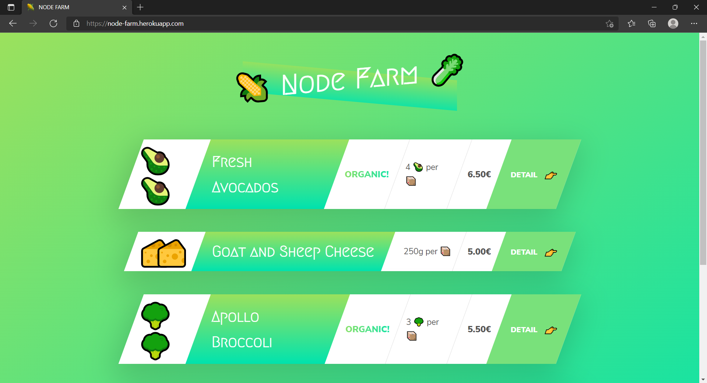
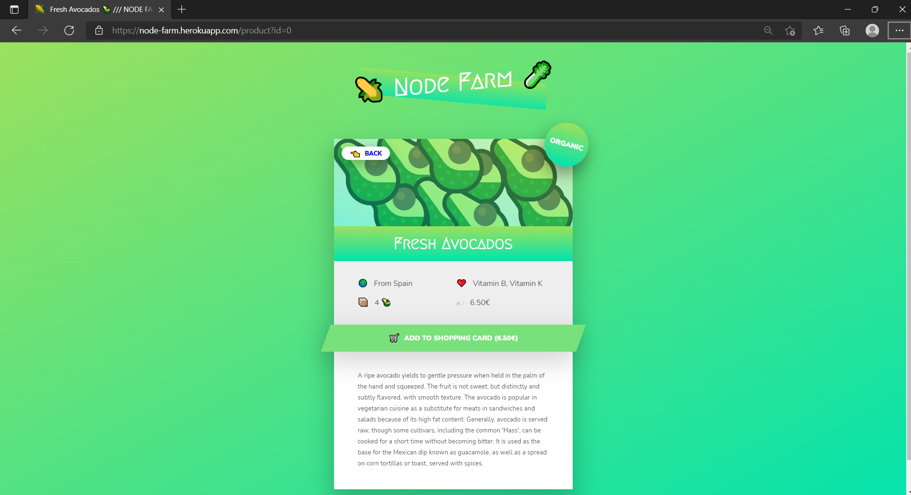
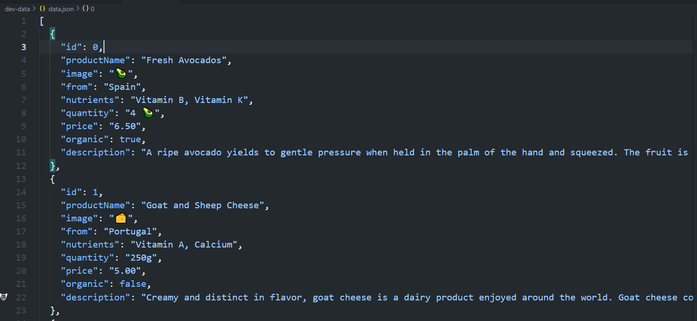
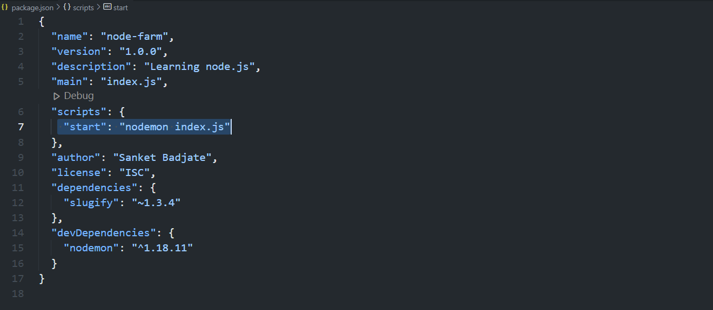

# Node farm

### Project live link: [NODE FARM (node-farm.herokuapp.com)](https://node-farm.herokuapp.com/)

### sample screenshots:





### Sample JSON:



---

`npm init`

## Libraries used:

`npm install slugify`

`npm install nodemon --save-dev`

`npm i nodmon --global`    → to install the nodemon globally. 

`npm i express` 



`npm start`

 

- To check thus any package is outdated

`npm outdated`

- Install a package with the required version number

`npm install slugify@1.0.0`

- Update the package

  `npm update slugify`

- Uninstall package

 `npm uninstall express` 

- `npm install`

---

`^version` **“Compatible with version”**, will update you to all future minor/patch versions, without incrementing the major version. `^2.3.4` will use releases from 2.3.4 to <3.0.0.

`~version` **“Approximately equivalent to version”**, will update you to all future patch versions, without incrementing the minor version. `~1.2.3` will use releases from 1.2.3 to <1.3.0.

---

- `version` Must match `version` exactly
- `>version` Must be greater than `version`
- `>=version` etc
- `<version`
- `<=version`
- `~version` "Approximately equivalent to version" See [semver](https://github.com/npm/node-semver#versions)
- `^version` "Compatible with version" See [semver](https://github.com/npm/node-semver#versions)
- `1.2.x` 1.2.0, 1.2.1, etc., but not 1.3.0
- `http://...` See 'URLs as Dependencies' below
- `` Matches any version
- `""` (just an empty string) Same as ``
- `version1 - version2` Same as `>=version1 <=version2`.
- `range1 || range2` Passes if either range1 or range2 are satisfied.
- `git...` See 'Git URLs as Dependencies' below
- `user/repo` See 'GitHub URLs' below
- `tag` A specific version tagged and published as `tag` See `[npm dist-tag](https://docs.npmjs.com/cli/v7/commands/npm-dist-tag)`
- `path/path/path` See [Local Paths](https://docs.npmjs.com/cli/v7/configuring-npm/package-json#local-paths) below

For example, these are all valid:

```
{
  "dependencies": {
    "foo": "1.0.0 - 2.9999.9999",
    "bar": ">=1.0.2 <2.1.2",
    "baz": ">1.0.2 <=2.3.4",
    "boo": "2.0.1",
    "qux": "<1.0.0 || >=2.3.1 <2.4.5 || >=2.5.2 <3.0.0",
    "asd": "http://asdf.com/asdf.tar.gz",
    "til": "~1.2",
    "elf": "~1.2.3",
    "two": "2.x",
    "thr": "3.3.x",
    "lat": "latest",
    "dyl": "file:../dyl"
  }
}

```

npm allows installing newer version of a package than the one specified. Using tilde (`~`) gives you bug fix releases and caret (`^`) gives you backwards-compatible new functionality as well.

The problem is old versions usually don't receive bug fixes that much, so npm uses caret (`^`) as the default for `--save`.

---

### Extension used in vs code

- prettier (Install→ settings→format on save )
- TODO highlight
- TabNine
- pug beautify
- live server

To configure the prettier

→make a file with name → `.prettierrc` 

[Options · Prettier](https://prettier.io/docs/en/options.html)


`To run the above app-` 

`you have to download the NPM in your machine. After that follow the below steps-` 

- `Clone the Repository in your local machine`
- `Now go inside the Node Farm directory using the command line or linux terminal`
- `Type command -    
 npm install
 node index.js`
- `Above command will create the local server.`


## Thank you! 